# 🖨️ Bambu Lab Printer Web App

<div align="center">

**Professionelle Steuerung & Überwachung für Bambu Lab 3D-Drucker mit nativer iOS/Android App**

[](https://www.python.org/downloads/)
[](https://www.apple.com/ios/)

[Features](#-features) • [Installation](#-installation) • [iOS App](#-ios-app-features) • [Screenshots](#-screenshots)

<br>

<a href="https://buymeacoffee.com/joschiv1977" target="_blank">
  
</a>

Ab 5 Euro/Dollar gibt es von Buy Me A Coffee eine Jahreslizenz die dann 365 Tage gültig ist, und ab 29 Euro gibt es eine Lifetime Lizenz ;-)

<a href="https://testflight.apple.com/join/99nPkbVn" target="_blank">MacOS / iOS Testflight</a>
</div>

---

## ✨ Features im Überblick

### 🎮 Drucker-Steuerung
- ⚡ **Echtzeit-Überwachung** via MQTT mit <100ms Latenz
- 🎯 **Developer Mode** für direkte G-Code Befehle & Achsen-Steuerung
- 🌡️ **Temperatur-Management** für Düse, Bett & Kammer
- 💨 **Lüftersteuerung** (Part/Aux/Chamber)
- 💡 **Kammer-Beleuchtung** mit Auto-Timer
- 🔌 **Smart Power Management** (Auto Power-Off, Home Assistant, Meross)
- 🔧 **Intelligentes Wartungssystem** - Automatisches Tracking & Erinnerungen

### 📱 Native iOS App
Die iOS App bietet modernste Features, die keine andere 3D-Drucker-App hat:

#### 🌟 Live Activities & Dynamic Island (iOS 16.1+)
- **Lock Screen Integration** - Druckfortschritt direkt am Sperrbildschirm
- **Dynamic Island** - Kompakte Echtzeit-Anzeige am iPhone 14 Pro+
- **Push-to-Start** - Automatischer Start bei Druckbeginn
- **Echtzeit-Updates** - Fortschritt, Restzeit, Layer-Info

#### 🏠 Home Screen Widgets
- **Mehrere Größen** - Klein, Mittel, Groß
- **Live-Daten** - Druckfortschritt, Temperaturen, Thumbnail
- **Schnellzugriff** - Direkt zum Drucker

#### 🔥 Filament-Trocknung
- **Material-Bibliothek** - Vordefinierte Trocknungsprofile (PLA, PETG, ABS, etc.)
- **Intelligente Konflikterkennung** - Verhindert Druckstart während Trocknung
- **Skip Homing Option** - Für mehrfache Trocknungen ohne Wartezeit
- **Progress Tracking** - Live-Fortschrittsanzeige mit Countdown

#### 📅 Geplante Drucke
- **Druck-Scheduler** - Zeitgesteuerte Druckaufträge
- **Konflikt-Prävention** - Automatische Prüfung auf Überschneidungen
- **Intelligente Warnungen** - Verhindert Probleme mit laufenden Prozessen

### 📊 Monitoring & Analyse
- 📈 **Sensor-Charts** - Echtzeit-Diagramme für Temperaturen, Lüfter, Power
- 📚 **Druck-Historie** - SQLite-Datenbank mit detaillierten Statistiken
- 🎬 **Timelapse-Videos** - Automatische Aufnahme & Konvertierung
- 📸 **Live-Kamera** - MJPEG-Stream vom Drucker oder µStreamer

### 🔔 Multi-Channel Benachrichtigungen
- 📱 **Firebase Cloud Messaging** (iOS Push mit Rich Media)
- 🌐 **Web Push Notifications** (Browser-basiert)
- 🖼️ **Thumbnails & Bilder** in Benachrichtigungen
- 🎯 **Event-Trigger:** Druckstart, Meilensteine (25/50/75/100%), Ende, Fehler
- 🔕 **Do Not Disturb** Zeitfenster

### 🧵 Filament-Management
- 🔌 **Spoolman Integration** - Automatisches Filament-Tracking
- 🎨 **Multi-Filament Support** - AMS-kompatibel
- 💰 **Kosten-Berechnung** - Filament & Stromkosten pro Druck
- 📦 **3MF-Analyse** - Automatische Gewichts-Extraktion

### 🔧 Intelligentes Wartungssystem
Das Wartungssystem überwacht automatisch den Zustand deines Druckers und erinnert dich an notwendige Wartungsarbeiten - **bevor** Probleme auftreten.

#### 📊 Automatisches Tracking
- **🕐 Druckstunden** - Erfassung über MQTT nach jedem erfolgreichen Druck
- **🖨️ Druckanzahl** - Zählt alle erfolgreichen Drucke
- **🧵 Filamentverbrauch** - Tracking in Gramm/Rollen
- **📅 Zeitbasierte Intervalle** - Kalenderbasierte Wartungen (Tage)

#### 🎯 Flexible Wartungsintervalle
Jede Wartungsaufgabe kann nach verschiedenen Kriterien fällig werden:
- **Stunden** - Nach X Druckstunden (z.B. "Düse reinigen nach 100h")
- **Drucke** - Nach X erfolgreichen Drucken (z.B. "Bett nivellieren nach 50 Drucken")
- **Filament** - Nach X Kilogramm/Rollen (z.B. "Extruder schmieren nach 2kg")
- **Tage** - Zeitbasiert (z.B. "Lüfter reinigen alle 30 Tage")

#### 📋 Vordefinierte Wartungspläne
Für jeden Drucker-Typ stehen professionelle Wartungspläne bereit:

**Bambu Lab P1P/P1S:**
- Düsenwechsel & Reinigung (alle 250h)
- Druckbett-Nivellierung (alle 50 Drucke)
- Linear-Schienen schmieren (alle 2kg Filament)
- Lüfter-Reinigung (alle 30 Tage)
- Riemen-Spannung prüfen (alle 100h)
- P1S spezifisch: Aktivkohle-Luftfilter (alle 720h)

**Bambu Lab X1 Carbon:**
- Alle P1P/P1S Wartungen
- Carbon-Stange reinigen (alle 200h)
- Hardened Steel Nozzle Check (alle 500h)
- Laser-Sensor Kalibrierung (alle 60 Tage)

**Bambu Lab A1/A1 Mini:**
- Düsenwechsel (alle 200h)
- Bett-Leveling (alle 40 Drucke)
- Bendy-Welle schmieren (alle 1.5kg Filament)
- Bowden-Schlauch prüfen (alle 45 Tage)

#### 🎨 Dashboard & Übersicht
- **🏠 Widget auf Homescreen** - Kompakte Anzeige (2×2 Grid) mit Überfällig/Fällig-Counter
- **📊 Wartungsliste** - Sortiert nach Dringlichkeit mit Farb-Codierung
- **🔴 Überfällig** - Rot markiert, sofortiger Handlungsbedarf
- **🟠 Fällig** - Orange, nächste 3 Tage
- **🟢 Geplant** - Grün, zukünftige Wartungen

#### ⚠️ Intelligente Benachrichtigungen
- **Prioritätsbasiert** - Unterschiedliche Vorlaufzeiten je nach Wichtigkeit:
  - **Critical:** 14, 7, 3, 1 Tag(e) vorher + am Tag selbst
  - **High:** 7, 3, 1 Tag(e) vorher + am Tag selbst
  - **Medium:** 7, 1 Tag(e) vorher + am Tag selbst
  - **Low:** 3 Tage vorher + am Tag selbst
- **Keine Doppel-Benachrichtigungen** - 24h Cooldown pro Task

#### ✅ Wartungs-Management
- **📝 Checklisten** - Schritt-für-Schritt Anleitungen für jede Wartung
- **📅 Wartungshistorie** - Alle durchgeführten Wartungen mit Notizen
- **🔄 Automatische Neuberechnung** - Next-Due wird nach Completion berechnet
- **✏️ Anpassbare Tasks** - Intervalle, Priorität, Kategorien editierbar
- **➕ Eigene Wartungen** - Erstelle custom Tasks nach deinen Bedürfnissen
- **🗑️ Löschen** - Nicht benötigte Wartungen entfernen
- **🔄 Plan-Initialisierung** - Lade vordefinierte Pläne für dein Modell

#### 🏷️ Kategorien & Prioritäten
**Kategorien:**
- 🧹 **Cleaning** - Reinigungsarbeiten
- 💧 **Lubrication** - Schmierung beweglicher Teile
- 🔍 **Inspection** - Sichtprüfungen
- 🔧 **Replacement** - Verschleißteile wechseln
- ⚙️ **Maintenance** - Allgemeine Wartung

**Prioritäten:**
- 🔴 **Critical** - Drucker-Sicherheit, sofortiger Handlungsbedarf
- 🟠 **High** - Wichtig für Druckqualität
- 🟡 **Medium** - Regelmäßige Wartung
- 🟢 **Low** - Optional, verlängert Lebensdauer

#### 💾 Datenspeicherung
- **SQLite-Datenbank** (`print_history.db`) - Persistente Speicherung
- **Keine Datenverluste** - Wartungen überleben Neustarts
- **Backup-fähig** - Einfache Sicherung der gesamten DB
- **Migrierbar** - DB-Datei kann auf andere Systeme übertragen werden

#### 🌍 Mehrsprachig
- 🇩🇪 Deutsch
- 🇬🇧 Englisch
- 🇫🇷 Französisch
- 🇪🇸 Spanisch
- 🇮🇹 Italienisch

### 🏠 Smart Home Integration
- 🏡 **Home Assistant** - Native MQTT Auto-Discovery
- 🔌 **Meross Smart Plug** - Direkte Steuerung ohne HA
- 📊 **Alle Sensoren** als HA-Entities verfügbar
- 🎮 **Steuerungs-Entities** für Aktionen

### 🔐 Enterprise Security
- 🔑 **JWT-basierte Authentifizierung** mit Access & Refresh Tokens
- 👥 **Multi-User Support** mit Rollen (Admin, Guest)
- 🛡️ **Rate Limiting** - Schutz vor Brute-Force
- 🚫 **Path Traversal Protection** - Validierte Dateioperationen
- 🔒 **Device Token Authentication** für iOS App

---

## 📸 Screenshots

<div align="center">

### 🔐 Login & Dashboard
<a href="docs/screenshots/Login.png">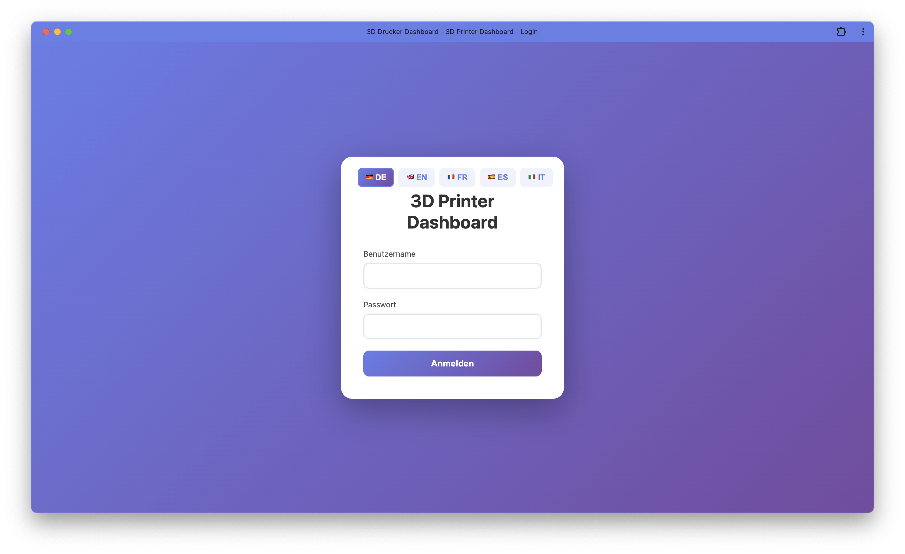</a>
<a href="docs/screenshots/UbersichtKamera.png">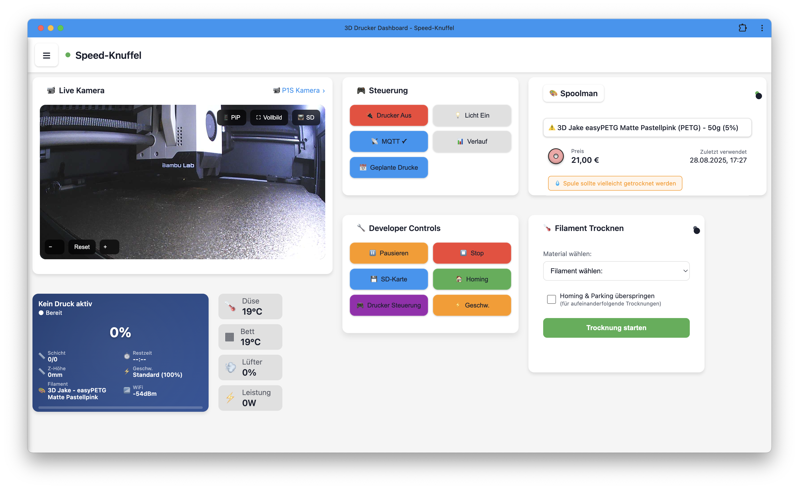</a>
<a href="docs/screenshots/MenuBar.png">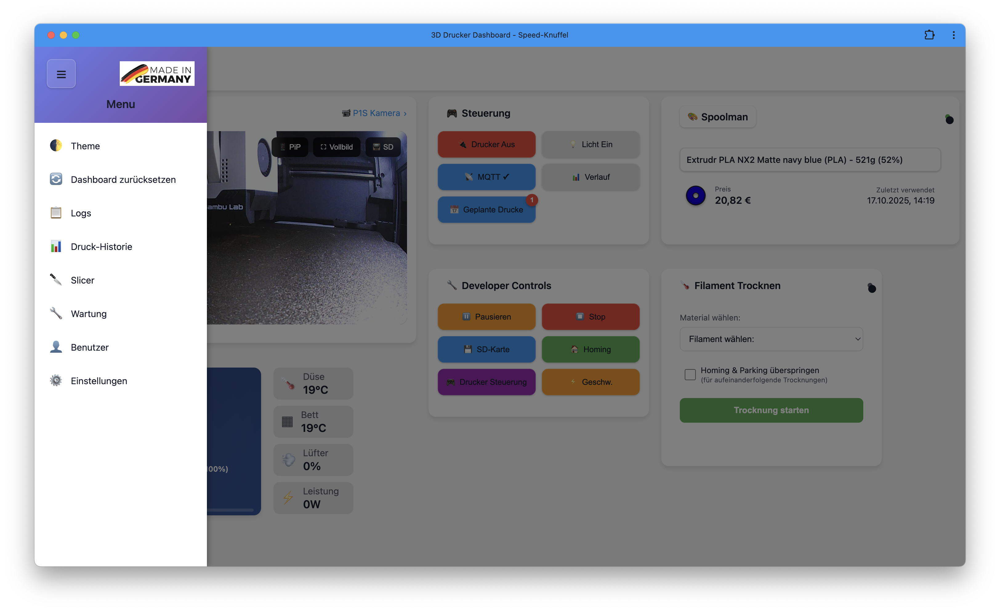</a>

### 🎮 Drucker-Steuerung
<a href="docs/screenshots/Druckersteuerung.png">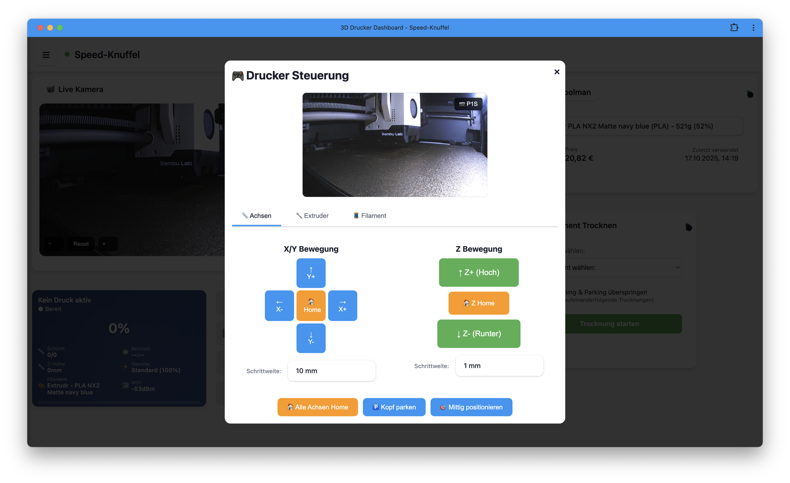</a>
<a href="docs/screenshots/DruckersteuerungExtruder.png">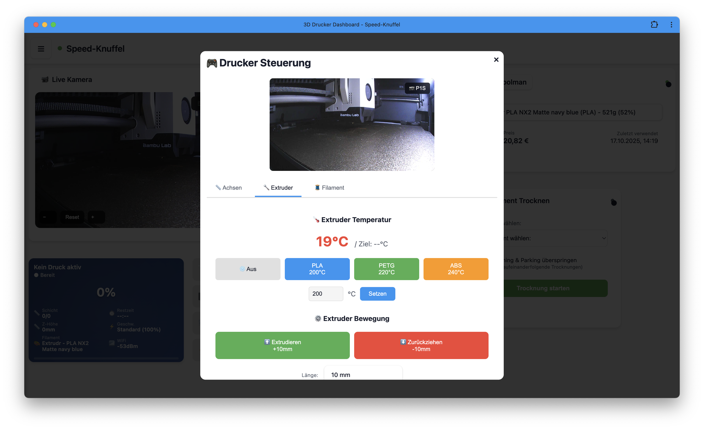</a>
<a href="docs/screenshots/DruckersteuerungFilament.png">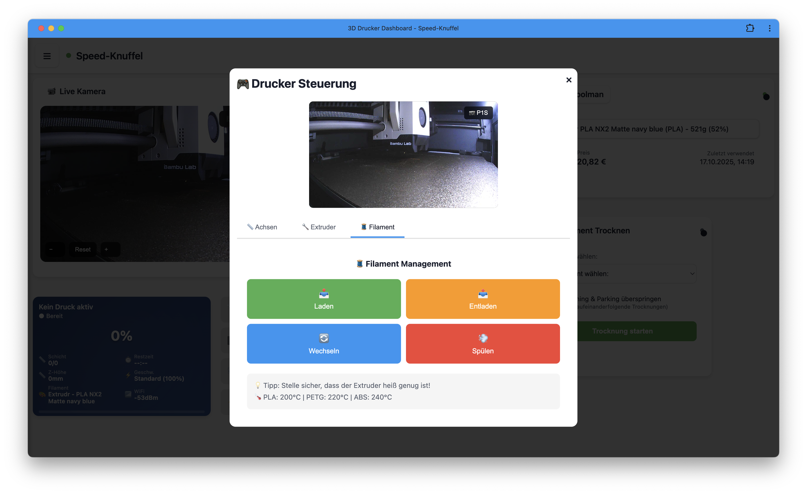</a>

### 💾 SD-Karte & Dateien
<a href="docs/screenshots/SD-Card.png">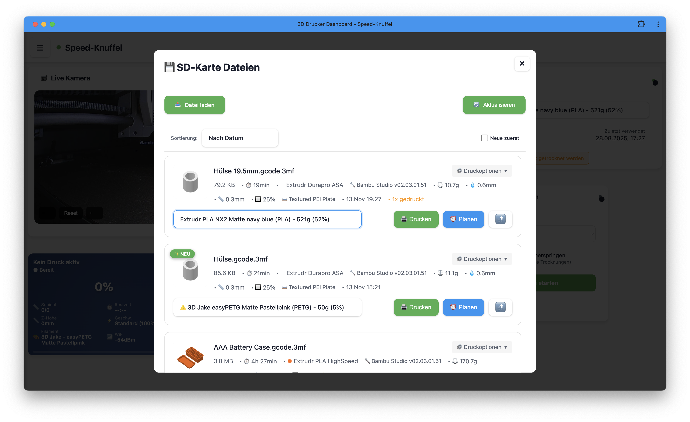</a>
<a href="docs/screenshots/SD-CardmitDruckoptionen.png">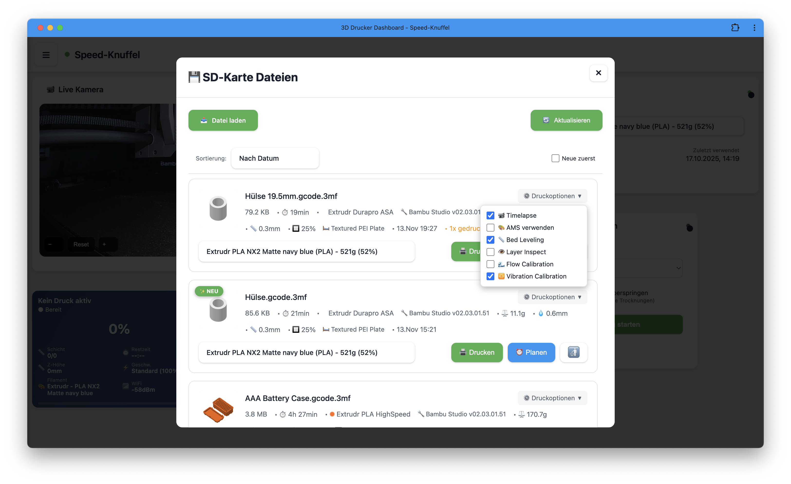</a>
<a href="docs/screenshots/SD-CardMultiFilament.png">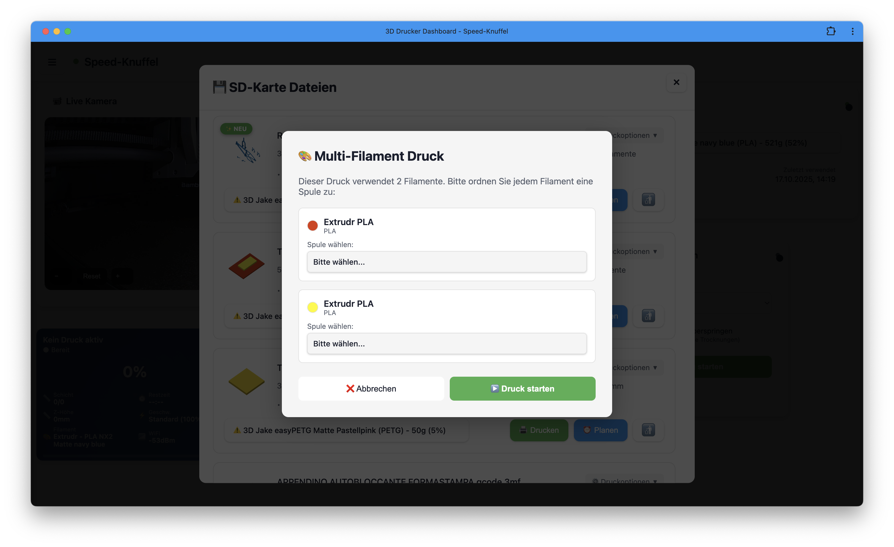</a>

### 📅 Druckplanung
<a href="docs/screenshots/SD-CardDruckplanen.png">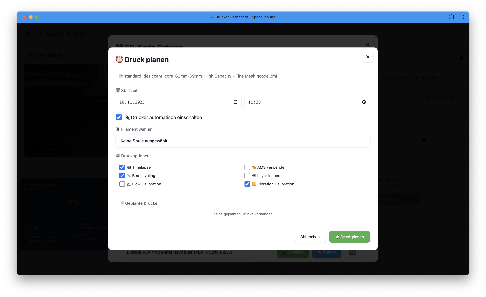</a>
<a href="docs/screenshots/DruckplanenErstellen.png">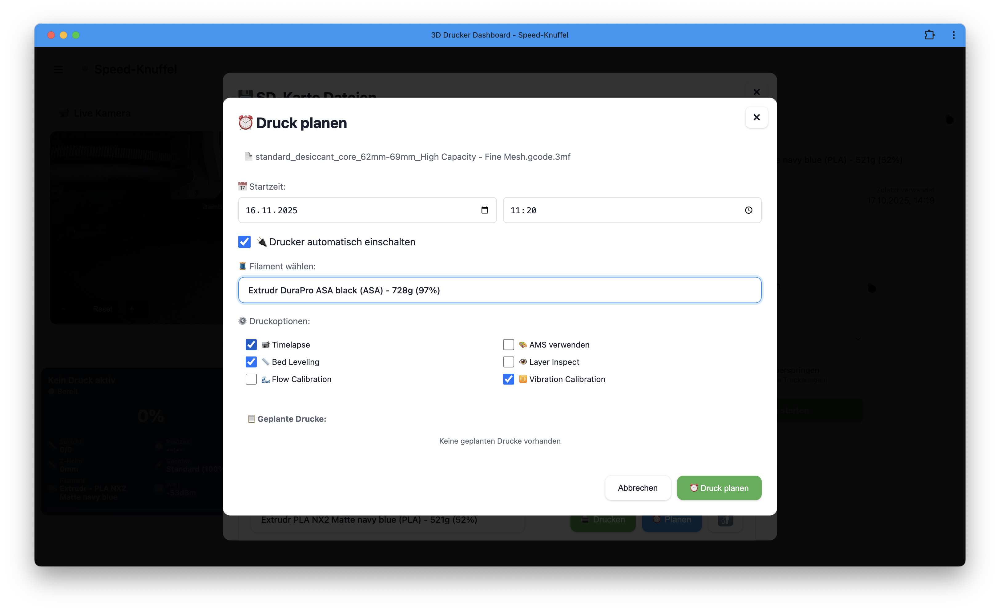</a>
<a href="docs/screenshots/GeplanteDruckeubersicht.png"></a>

### 📊 Druck-Historie
<a href="docs/screenshots/DruckHistorieUbersicht.png">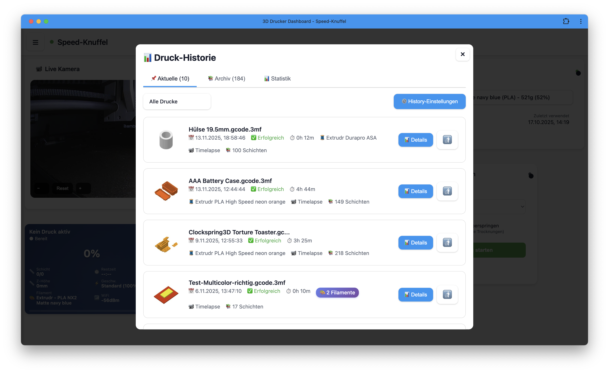</a>
<a href="docs/screenshots/DruckHistorieStatistik.png">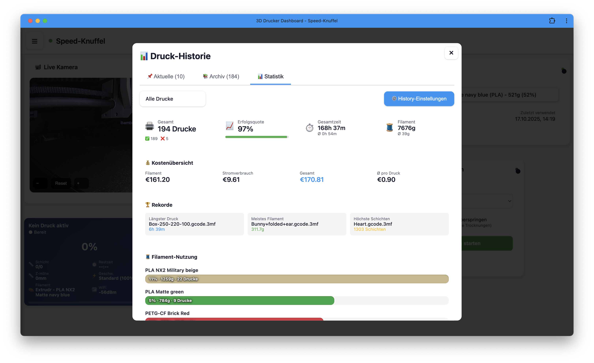</a>

### ⚙️ Einstellungen
<a href="docs/screenshots/Settingsubersicht.png">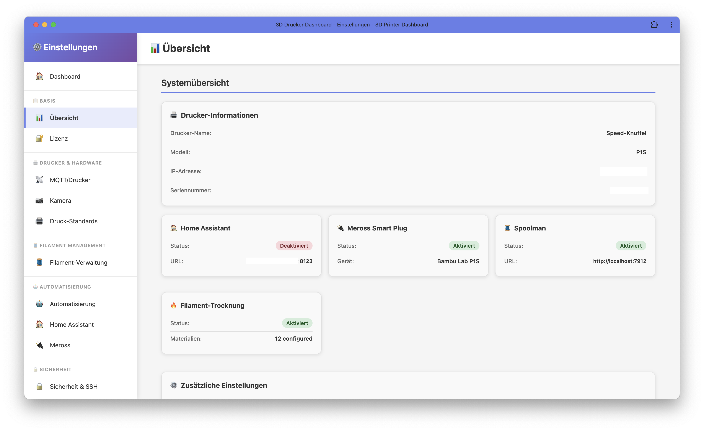</a>
<a href="docs/screenshots/SettingsDrucker.png">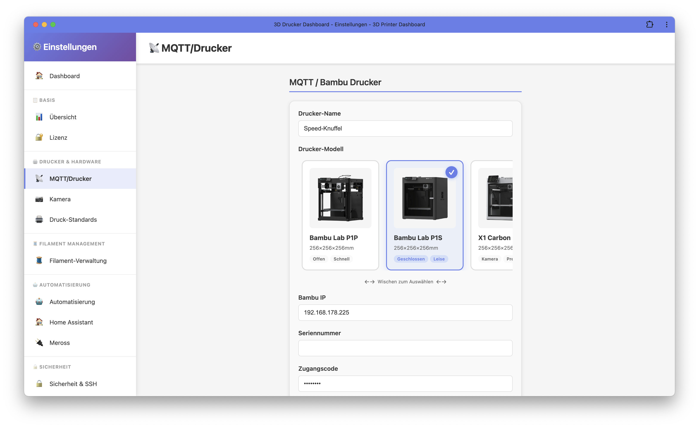</a>
<a href="docs/screenshots/SettingsDruckstandard.png"></a>

### 🔪 Slicer
<a href="docs/screenshots/Slicer.png">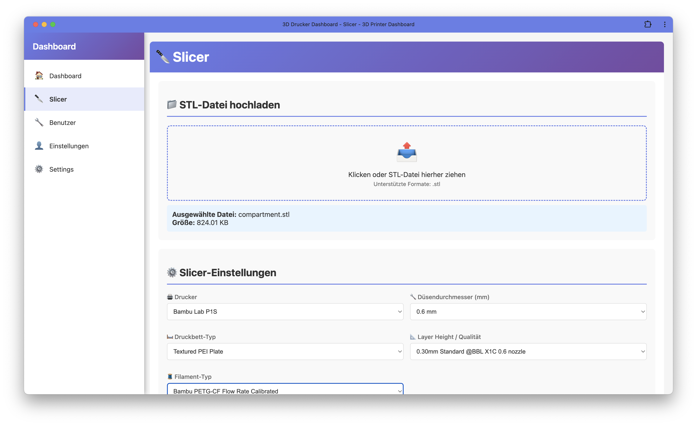</a>

</div>

---

## 🚀 Installation

### ⚡ Schnellinstallation (1 Befehl)

curl -fsSL https://raw.githubusercontent.com/joschiv1977/3D-Printer-Dashboard/main/quick-install.sh | bash

> **Was macht das Script?**
> - Installiert alle Abhängigkeiten automatisch
> - Richtet Systemd-Service ein
> - Generiert SSL-Zertifikate
> - Öffnet Setup-Seite automatisch

### 📦 Manuelle Installation

# Installer ausführen
sudo chmod +x install.sh
sudo ./install.sh
```

### Web-Interface öffnen

```bash
https://localhost:5555

# Standard-Login
Benutzername: admin
Passwort: admin123
```

⚠️ **WICHTIG:** Passwort nach erster Anmeldung ändern!

---

## 🔄 Update

Das Update ist mit einem einzigen Befehl erledigt – die Plattform (x86_64 / ARM64) wird automatisch erkannt:

```bash
cd /opt/printer-web-app
sudo ./manage.sh update
```

> **Was passiert beim Update?**
> 1. Service wird gestoppt
> 2. Neueste Version wird von GitHub geladen (`git pull`)
> 3. Python-Dependencies werden aktualisiert
> 4. Plattform wird automatisch erkannt (x86_64 oder aarch64)
> 5. Die passenden kompilierten Module werden nach `dist/` kopiert
> 6. Service wird neu gestartet

**Alternativ** kannst du auch nur die kompilierten Module neu deployen (ohne `git pull`):

```bash
sudo ./manage.sh deploy
```

Falls du das Management-Menü bevorzugst:

```bash
sudo ./manage.sh
# → Option 5: Update (Git Pull + Deploy)
# → Option 6: Deploy (nur Module deployen)
```

---

## 📱 iOS App Features

### Installation der iOS App

1. Öffne das Projekt in Xcode:
   ```bash
   open iOS/SpeedKnuffelPrinter/SpeedKnuffelPrinter.xcworkspace
   ```

2. **Firebase konfigurieren** (für Push-Benachrichtigungen):
   - Erstelle ein Firebase-Projekt
   - Lade `GoogleService-Info.plist` herunter
   - Füge es zum iOS Projekt hinzu

3. **Build & Run** auf einem physischen iOS-Gerät (ab iOS 16.1)

### Einzigartige iOS Features

#### 🌟 Live Activities

<div align="center">

| Funktion | Beschreibung |
|----------|--------------|
| **Lock Screen Widget** | Druckfortschritt immer sichtbar |
| **Dynamic Island** | Kompakte Ansicht am iPhone 14 Pro+ |
| **Push-to-Start** | Automatischer Start via Push |
| **Echtzeit-Updates** | Max. 1 Update/Sekunde (Apple Limit) |

</div>

#### 🔥 Filament-Trocknung

```
Materialien mit vordefinierten Profilen:
• PLA      → 50°C, 6h
• PETG     → 65°C, 6h
• ABS      → 70°C, 12h
• TPU      → 55°C, 8h
• PA (Nylon) → 80°C, 16h
• ASA      → 70°C, 12h
```

**Features:**
- ✅ Intelligente Konflikterkennung
- ✅ Skip Homing & Parking für schnelle mehrfache Trocknung
- ✅ Live Progress Bar mit Gradient-Animation
- ✅ Automatische Druck-Blockierung während Trocknung

#### 📅 Scheduled Prints

- ⏰ Zeitgesteuerte Druckaufträge
- 🚫 Automatische Konflikt-Erkennung
- 📊 Dauer-Berechnung & Warnung bei Überschneidung
- 🔄 Integration mit Filament-Trocknung

#### 🎨 Weitere iOS Features

- **Theme Manager** - Light/Dark/Auto mit System-Sync
- **Offline-Mode** - Cached-Daten verfügbar
- **Multi-Printer Support** - Mehrere Drucker verwaltbar
- **Siri Shortcuts** - Kommandos via Siri
- **Background Refresh** - Automatische Updates
- **Haptic Feedback** - Moderne Interaktionen

---

## 🏗️ Tech Stack

### Backend
- **Python 3.9+** - Flask, SocketIO
- **MQTT** - Echtzeit-Kommunikation mit Drucker
- **Redis** - Caching & Rate Limiting
- **SQLite** - Druck-Historie & Wartungssystem
- **ffmpeg** - Timelapse-Konvertierung
- **FTPS** - Sicherer Datei-Zugriff auf SD-Karte

### iOS App
- **Swift 5.9+** - Modern SwiftUI & UIKit Hybrid
- **iOS 16.1+** - Live Activities, Dynamic Island
- **ActivityKit** - Lock Screen Widgets
- **WidgetKit** - Home Screen Widgets
- **Firebase** - Cloud Messaging
- **Socket.IO** - Echtzeit-Updates

### Integrationen
- **Spoolman** - Filament-Management
- **Home Assistant** - Smart Home
- **Meross** - Smart Plug Steuerung
- **µStreamer** - Raspberry Pi Kamera

---

## 📋 Systemanforderungen

| Komponente | Minimal | Empfohlen |
|------------|---------|-----------|
| **Python** | 3.9+ | 3.11+ |
| **RAM** | 512 MB | 2 GB+ |
| **Speicher** | 2 GB | 10 GB+ (mit Timelapses) |
| **CPU** | 1 Core @ 1GHz | 2+ Cores @ 1.5GHz |
| **Redis** | 6.0+ | Latest |
| **iOS** | - | 16.1+ (für Live Activities) |

### Unterstützte Drucker

- ✅ Bambu Lab P1P
- ✅ Bambu Lab P1S
- ✅ Bambu Lab X1 Carbon
- ✅ Bambu Lab X1E
- ✅ Bambu Lab A1
- ✅ Bambu Lab A1 Mini

---

## 🛠️ Management

```bash
# Service-Status prüfen
sudo systemctl status printer-web-app

# Logs ansehen
sudo journalctl -u printer-web-app -f

# Service neustarten
sudo systemctl restart printer-web-app

# Management-Script
./manage.sh
```

---

## 🐛 Troubleshooting

<details>
<summary><b>MQTT Connection Failed</b></summary>

1. IP-Adresse prüfen: `ping 192.168.1.100`
2. Access Code im Drucker neu generieren
3. Developer Mode aktivieren
4. Firewall prüfen: `sudo ufw allow 8883/tcp`
</details>

<details>
<summary><b>iOS Push-Benachrichtigungen funktionieren nicht</b></summary>

1. Firebase `GoogleService-Info.plist` vorhanden?
2. Backend `serviceAccountKey.json` konfiguriert?
3. FCM Token in Settings registriert?
4. App-Berechtigungen geprüft?
</details>

<details>
<summary><b>Live Activities starten nicht</b></summary>

1. iOS 16.1+ erforderlich
2. ActivityKit in Xcode aktiviert?
3. Push-to-Start Token registriert?
4. Network-Verbindung zum Server?
</details>

---

## 📖 API-Dokumentation

Die vollständige API ist REST-basiert mit JWT-Authentifizierung:

```bash
# Authentifizierung
POST /api/login
Authorization: Bearer <token>

# Hauptendpunkte
POST /api/start_print          # Druck starten
POST /api/stop_print           # Druck stoppen
GET  /api/sd_files             # SD-Karten Dateien
POST /api/upload               # Datei hochladen
GET  /api/print_history        # Druck-Historie
POST /api/dry/start            # Filament-Trocknung starten

# Wartungssystem
GET  /api/maintenance/printers              # Liste aller Drucker
GET  /api/maintenance/tasks/:printer_id     # Wartungsaufgaben
POST /api/maintenance/tasks/:printer_id     # Neue Wartung erstellen
PUT  /api/maintenance/tasks/:printer_id/:task_id      # Wartung bearbeiten
DELETE /api/maintenance/tasks/:printer_id/:task_id    # Wartung löschen
POST /api/maintenance/tasks/:printer_id/:task_id/complete  # Als erledigt markieren
GET  /api/maintenance/history/:printer_id   # Wartungshistorie
POST /api/maintenance/initialize/:printer_id # Wartungsplan laden
```

---

## 🎯 Roadmap

- [ ] Android App mit gleichen Features wie iOS
- [ ] Web-basierte Live Activities
- [ ] AI-basierte Fehler-Erkennung
- [ ] Multi-Drucker Dashboard
- [ ] Wartungssystem: Push-Benachrichtigungen bei fälligen Wartungen
- [ ] Wartungssystem: Automatische Ersatzteil-Bestellvorschläge
- [ ] Wartungssystem: Statistische Auswertungen & Reports


---

## 👤 Autor

**Joachim Vogel (joschiv77)**

---

## 📄 Lizenz
 Copyright (c) 2025 Joachim Vogel

---

## 🙏 Danksagungen

- **Bambu Lab** für Hardware & MQTT-Dokumentation
- **Flask & SocketIO Communities**
- **Firebase** für Cloud Messaging
- **Spoolman** Entwickler
- **Home Assistant** Community
- Alle Beta-Tester & Contributors

---

<div align="center">

**⭐ Wenn dir dieses Projekt gefällt, gib ihm einen Stern auf GitHub! ⭐**

Made with ❤️ for the 3D Printing Community

buymeacoffee.com/joschiv1977

</div>
