<div align="center">

# 🖨️ 3D Printer Dashboard

**Control and monitoring for Bambu Lab and Klipper 3D printers**
**— Web, Desktop, iOS and Android, one server behind all of them**

[](https://www.python.org/downloads/)
[](#-platforms)
[](#supported-printers)
[](#-operating-modes)
[](#-languages)
[](#-ios)
[](#-apps)

**[Setup guide](#-setup--step-by-step) · [Features](#-what-it-does) · [Screenshots](#-the-interface) · [Troubleshooting](#-when-something-goes-wrong)**

🇩🇪 **[Deutsche Fassung](README.de.md)**

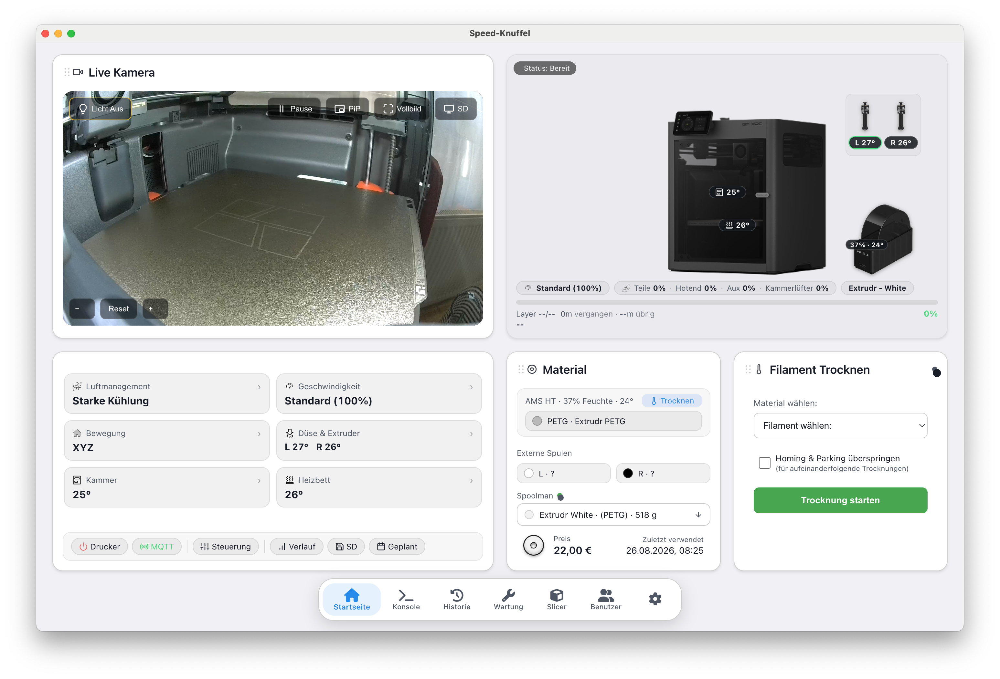

</div>

---

## What this repository is

This is the **distribution**. It carries the ready-built server, the web interface
and the installer — you do not compile anything. The source lives in a private
repository.

| What ships | |
|---|---|
| **149** compiled modules | `dist_aarch64/`, built for Python 3.13 |
| **765** slicer profiles | so a fresh install can slice immediately |
| **4** Bambu root certificates | so the printer connection is really verified |
| **Web interface** | five languages, 2313 strings each |
| **~130 MB** | the whole repository |

---

## 🚀 Setup — step by step

Nothing here assumes prior knowledge. Each step says what you should see; if you
see something else, the [troubleshooting section](#-when-something-goes-wrong)
covers it.

### Before you start

You need:

- a 64-bit Linux machine — a **Raspberry Pi 4 or 5** is the usual choice
- **Python 3.13** (Debian 13 ships it; check with `python3 --version`)
- the printer's **IP address**, **serial number** and **access code**
  → on the printer: *Settings → Network*. The access code is 8 characters and
  contains letters, not only digits
- a licence key (see [Licence](#-licence))

### Step 1 — run the installer

Copy this line into a terminal on the Pi:

```bash
curl -fsSL https://raw.githubusercontent.com/joschiv1977/3D-Printer-Dashboard/main/quick-install.sh | bash
```

Prefer to read it first? That is the better habit:

```bash
curl -fsSL https://raw.githubusercontent.com/joschiv1977/3D-Printer-Dashboard/main/quick-install.sh -o quick-install.sh
less quick-install.sh
bash quick-install.sh
```

**What you should see:** the platform is detected (`aarch64`, Python 3.13), then
the files are downloaded, then the installer runs and prints one block per step.
It takes 10–20 minutes on a Pi; the build tools for numpy and Pillow are the slow
part.

**Two questions come up**, both default to *no*, both safe to skip:
Cloudflare Tunnel (access from outside) and Firebase (push notifications). You can
set them up later.

**At the end** the installer prints the address of your server and the URL of the
setup wizard.

### Step 2 — open the interface

```
https://<ip-of-your-pi>:5555
```

Your browser will warn about the certificate. That is expected — it is
self-signed, valid for 825 days, and it is your own machine. Click through the
warning.

### Step 3 — the wizard, five steps


**1 · Licence**
Enter your key. The hardware id you need for the request is displayed on the same
page with a copy button.

**2 · Password**
The initial password is in `data/initial_password.txt` on the Pi:

```bash
sudo cat /opt/printer-web-app/data/initial_password.txt
```

It has no ambiguous characters — no `0`/`O`, no `1`/`l`/`I` — and comes in groups
of five so it can be typed off a screen. The file deletes itself once you have set
your own.

Your new password needs at least 12 characters with upper case, lower case, a
digit and a special character.

**3 · Printer**
Bambu or Klipper. The model list comes from the server, so it stays current. For
Bambu you enter IP, serial and access code; the access code field takes **8
characters** — letters included.

**4 · Socket**
Meross, Home Assistant, or **none**. "None" is a complete answer, not a gap: the
interface then decides the printer's presence from the live connection instead of
from a switch that does not exist.

**5 · Finish**
The server does the rest while you watch: slicer profiles, the maintenance plan
for the model you picked, a reachability check of the printer, and a warm-up of
the camera relay. Each task reports on its own; none of them can block the finish.
A printer that happens to be switched off does not hold up an installation.

Then the server restarts once and you land on the login page.

> **A reload during the wizard does not send you back to the start.** What you
> typed stays — except passwords and access codes, which you type again on
> purpose.

### Step 4 — that is it

Log in as `admin` with the password you just set.

---

## ✨ What it does

### 🎮 Printer control

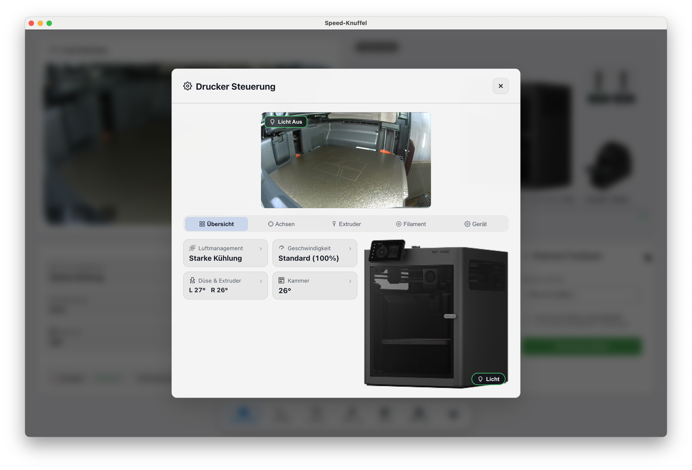

- ⚡ **Live monitoring** over MQTT, under 100 ms latency
- 🌡️ **Temperatures** for nozzle, bed and chamber
- 💨 **Fans** — part, aux, chamber
- 💡 **Chamber light** with an auto-off timer
- 🎯 **Developer mode** for direct G-code and axis control
- 🔌 **Power** — auto power-off, Home Assistant, Meross

The control dialog has five tabs: overview, axes, extruder, filament, device.

<div align="center">
<a href="docs/screenshots/control-axes.png">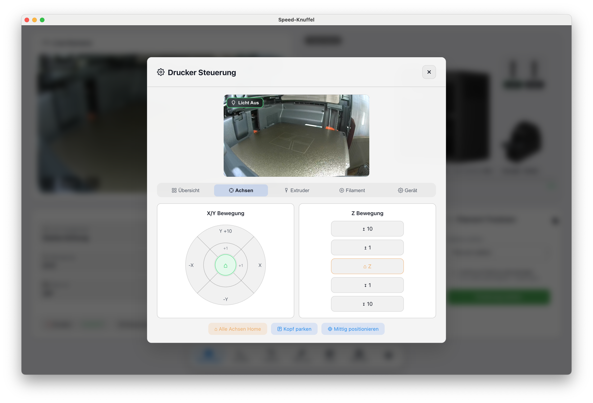</a>
<a href="docs/screenshots/control-extruder.png">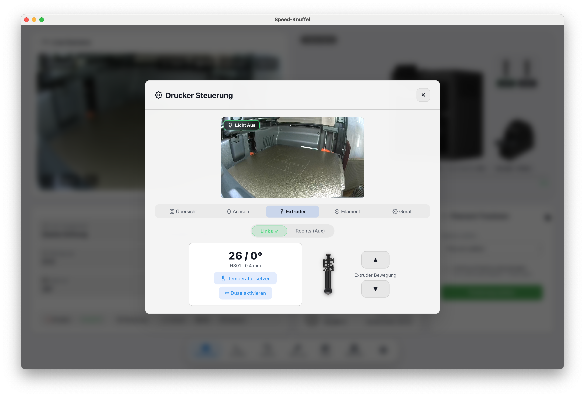</a>
<a href="docs/screenshots/control-filament.png">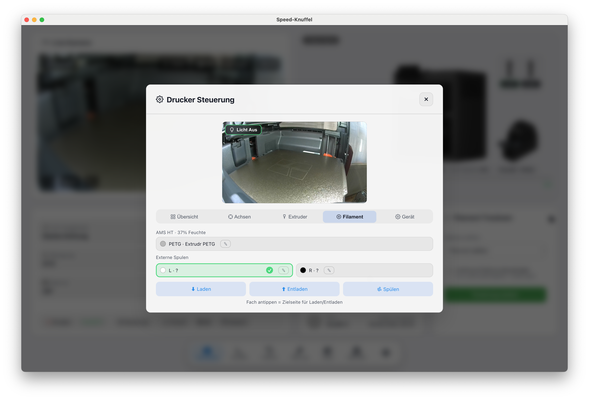</a>
<a href="docs/screenshots/control-device.png">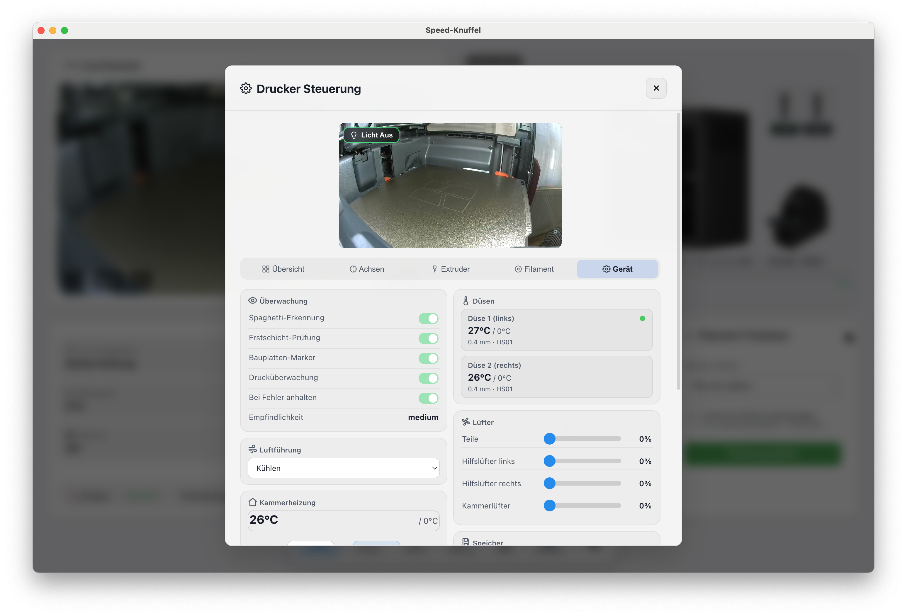</a>
</div>

### 📊 Monitoring & analysis

<div align="center">
<a href="docs/screenshots/history-detail.png">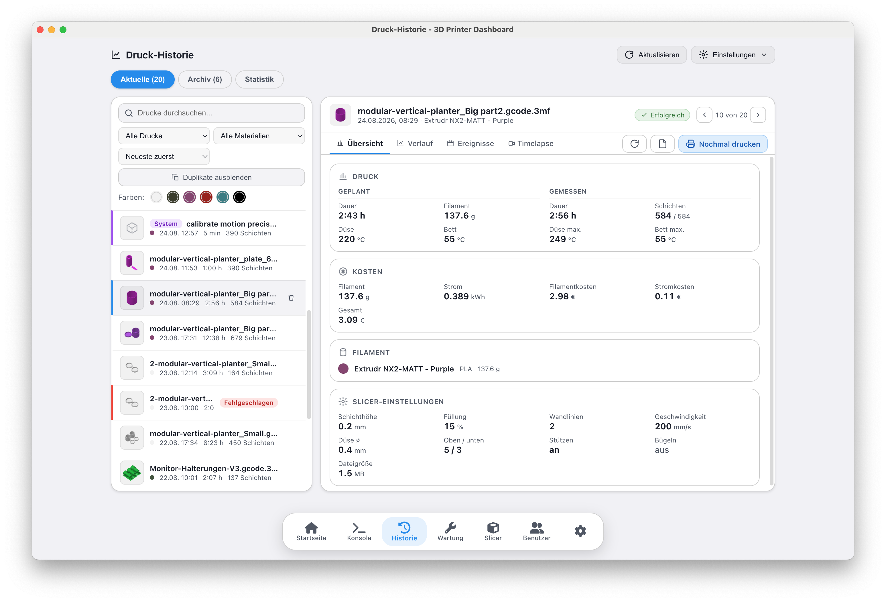</a>
<a href="docs/screenshots/history-chart.png">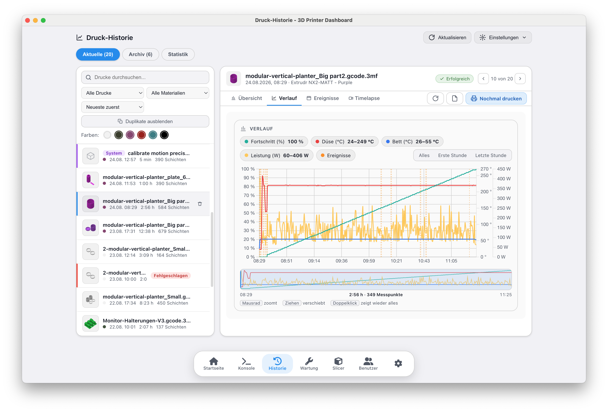</a>
<a href="docs/screenshots/history-events.png">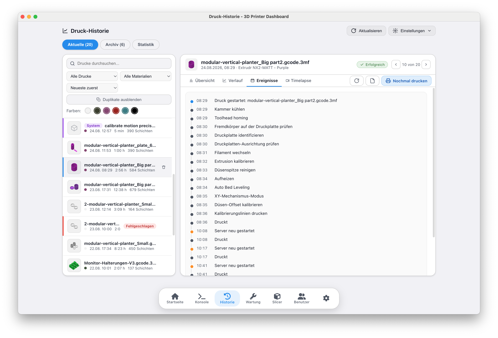</a>
<a href="docs/screenshots/history-statistics.png">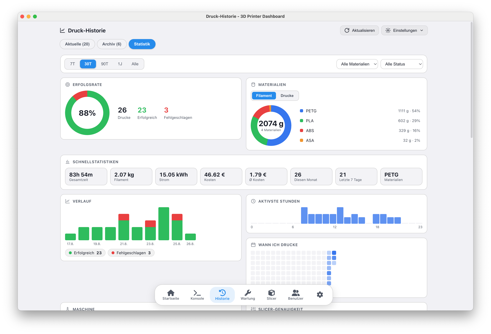</a>
</div>

- 📈 **Sensor charts** — temperatures, fans, power, live
- 📚 **Print history** — cost split into filament and power, and which nozzle
  printed when
- 🗺️ **Bed mesh snapshot** — captured per print and kept with it
- 🎬 **Timelapse** — recorded and converted automatically, cached offline in the apps
- ♻️ **Power-loss recovery** — a print survives a power cut. Verified on the
  machine at 0.0 mm offset. The goal is a chance instead of a total loss, not an
  invisible seam
- 🧪 **Calibrations are not prints** — system runs are marked as such and stay out
  of the statistics and the filament accounting
- 📸 **Live camera** — WebRTC through go2rtc, the printer's H.264 passed through
  unchanged, no transcoding. MJPEG stays as the fallback. Bambu models use two
  different protocols (port 6000 on P1/A1, RTSPS on X1/X2D/H2) — the source is
  read from the printer, never guessed from the model

### 🧵 Filament

- 🔌 **Spoolman** — automatic tracking, works offline too
- 🎨 **Multi-filament / AMS** — spools are bound to the nozzle they actually hang on
- 🔥 **Drying** — before a scheduled print, during a print, or straight from the
  AMS; profiles follow the Studio recommendation
- 💡 **Spool suggestion** — the spool matching the file is offered, not simply the
  active one
- 💰 **Cost** — filament and power, per print
- 📦 **3MF analysis** — weight extracted automatically

```
Drying profiles          PLA  50 °C ·  6 h      ABS  70 °C · 12 h
                         PETG 65 °C ·  6 h      ASA  70 °C · 12 h
                         TPU  55 °C ·  8 h      PA   80 °C · 16 h
```

### 🔧 Maintenance

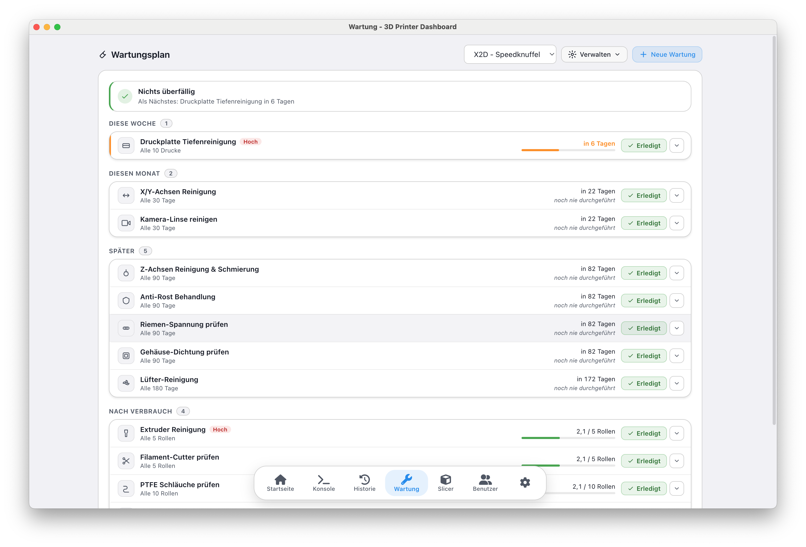

The maintenance system watches the printer's condition and reminds you **before**
something goes wrong.

**Tracked automatically:** print hours, print count, filament in grams, and
calendar days.

**Intervals** can be based on any of those — "clean the nozzle after 100 h",
"level the bed after 50 prints", "lubricate after 2 kg", "clean the fans every
30 days".

**Ready-made plans** per model, loaded in the wizard's last step. The X2D plan has
19 tasks and four baselines.

| Priority | Reminded |
|---|---|
| 🔴 Critical | 14, 7, 3, 1 days before, and on the day |
| 🟠 High | 7, 3, 1 days before, and on the day |
| 🟡 Medium | 7, 1 days before, and on the day |
| 🟢 Low | 3 days before, and on the day |

Categories: 🧹 cleaning · 💧 lubrication · 🔍 inspection · 🔧 replacement ·
⚙️ general. Each task carries a checklist, a history and its own interval, and you
can add your own.

### 📅 Scheduling & SD card

<div align="center">
<a href="docs/screenshots/scheduled-prints.png">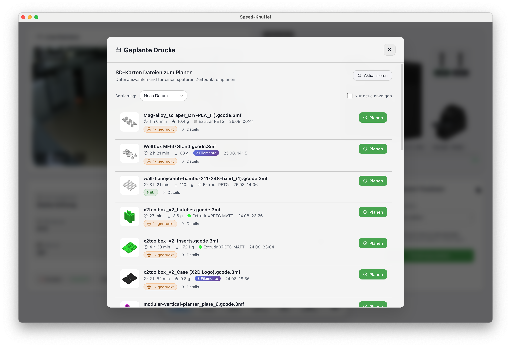</a>
<a href="docs/screenshots/schedule-create.png">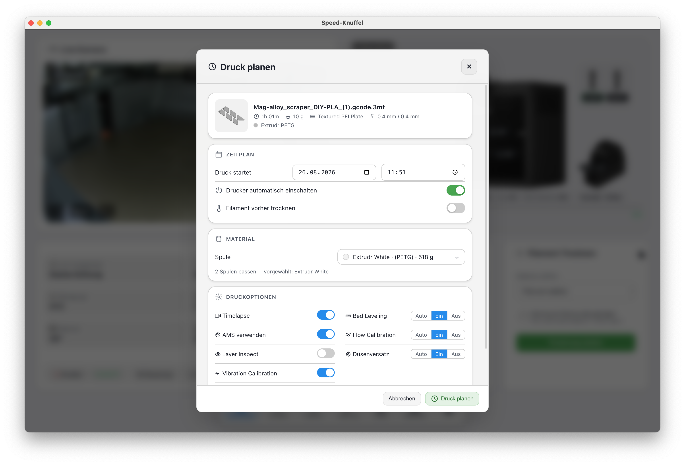</a>
<a href="docs/screenshots/sdcard.png">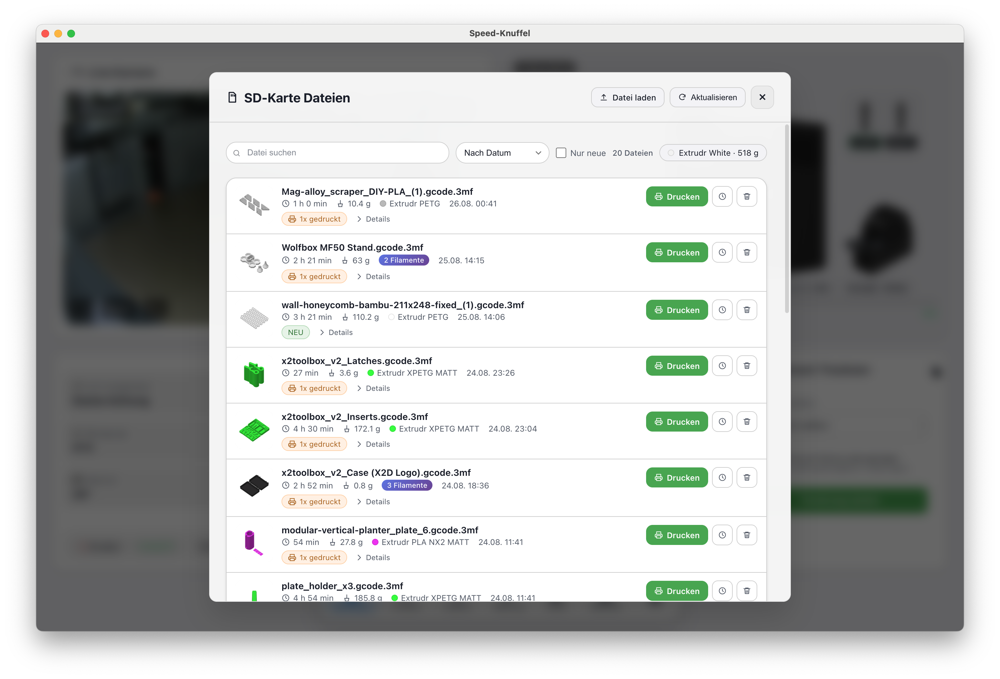</a>
<a href="docs/screenshots/print-options.png">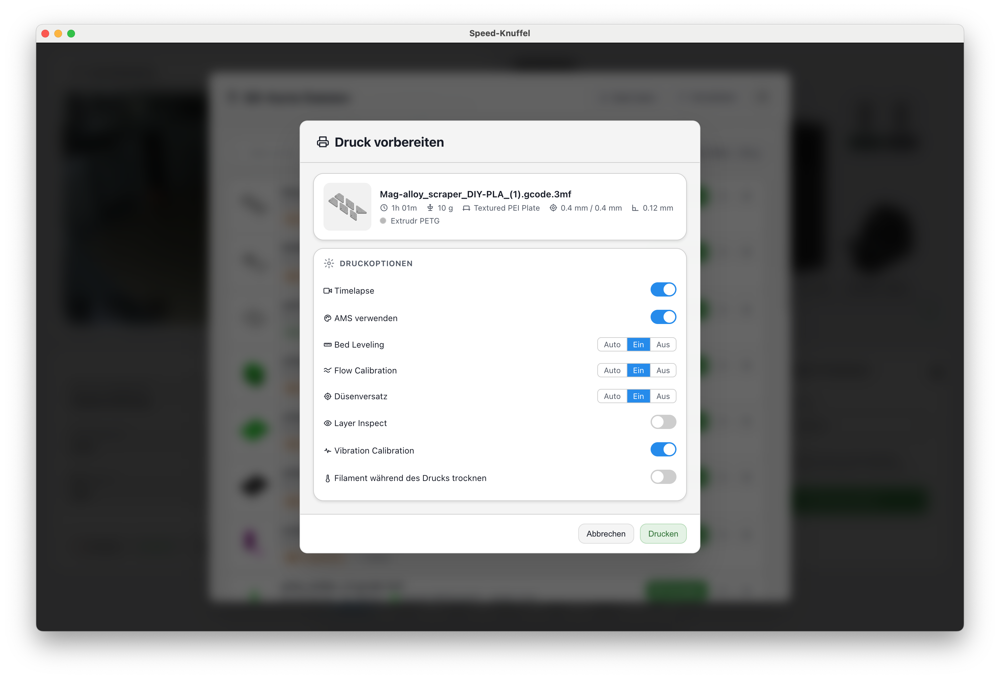</a>
</div>

Time-based print jobs with overlap detection, and the printer's SD card with print
options, multi-filament mapping and thumbnails.

### 🔪 Slicer


OrcaSlicer runs on the server. Drop in an STL or STEP, pick printer, nozzle and
quality, and the result goes straight to the SD card.

The 765 profiles ship with this repository, so a fresh install can slice at once —
no waiting for 965 downloads from GitHub. The updater then only compares.

### 🔔 Notifications

- 📱 **Firebase Cloud Messaging** with thumbnails
- 🌐 **Web push** in the browser
- 🎯 **Triggers** — start, 25/50/75/100 %, finish, error
- 🔕 **Quiet hours**

### 🏠 Smart home

Home Assistant over MQTT auto-discovery, all sensors as entities, control entities
for actions. Meross smart plugs directly, over the LAN, without the cloud.

### 🔐 Security

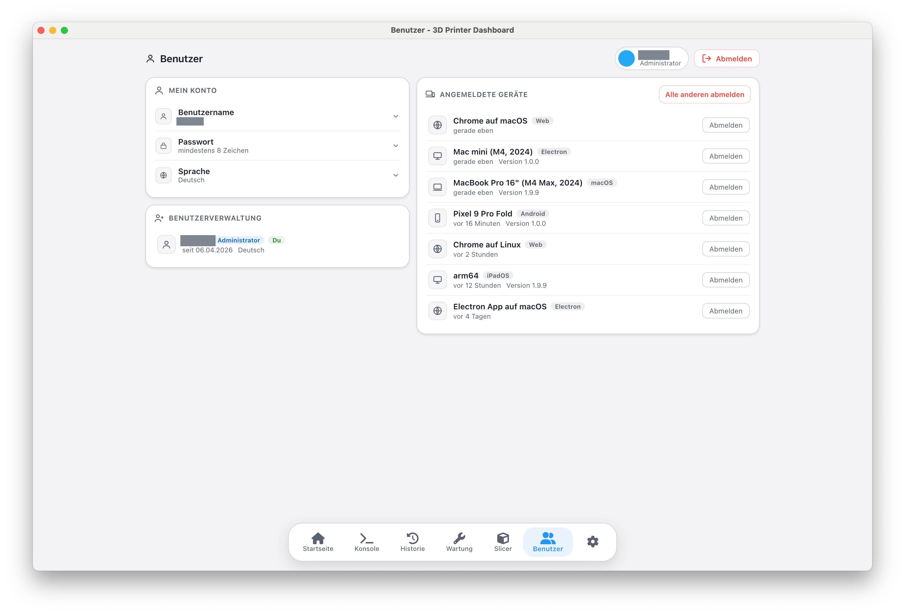

- 🔑 **JWT** with access and refresh tokens
- 👥 **Multiple users** with roles
- 🛡️ **Rate limiting** against brute force
- 🚫 **Path traversal protection** on every file operation
- 🔒 **Device tokens** for the mobile apps
- 🪪 **Licence** — Ed25519-signed, verified offline, bound to the machine

---

## 🖥️ The interface

The whole app is built from the same parts: cards with a heading and a hint line,
rows with a name on the left and a value on the right, and one dock at the bottom.
Status is never colour alone — there is always a glyph or a word beside it.

| | | | | | | |
|---|---|---|---|---|---|---|
| 🏠 **Home** | ⌨️ **Console** | 🕐 **History** | 🔧 **Maintenance** | 📦 **Slicer** | 👥 **Users** | ⚙️ **Settings** |

**Dialogs** — fans, speed, temperatures, editing filament, choosing a spool, and
the sensor history:

<div align="center">
<a href="docs/screenshots/dialog-fans.png">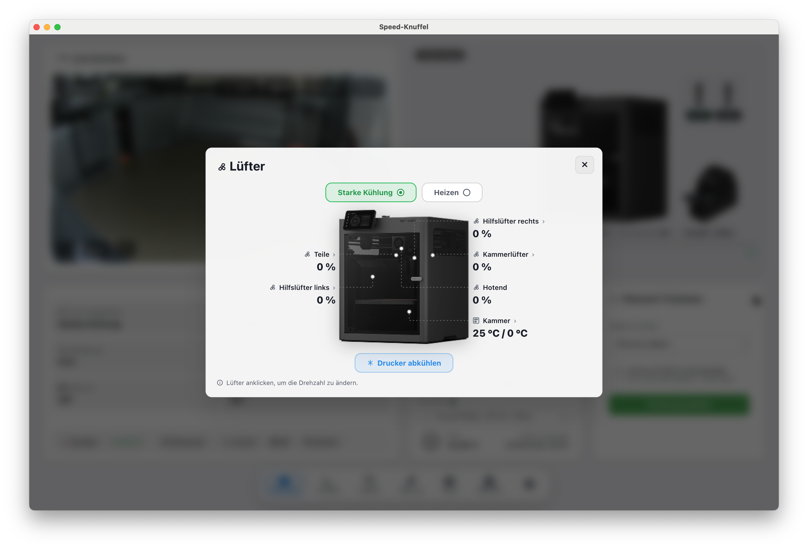</a>
<a href="docs/screenshots/dialog-speed.png">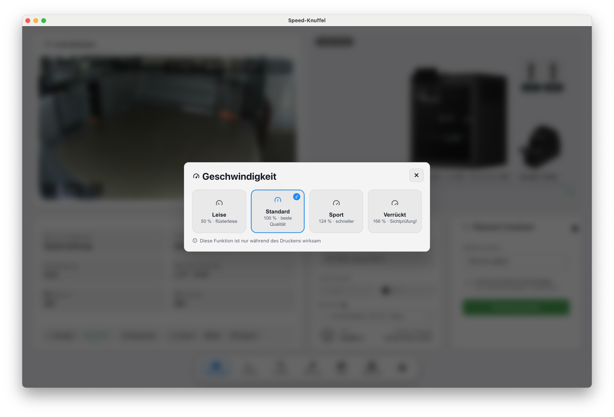</a>
<a href="docs/screenshots/dialog-temperature.png">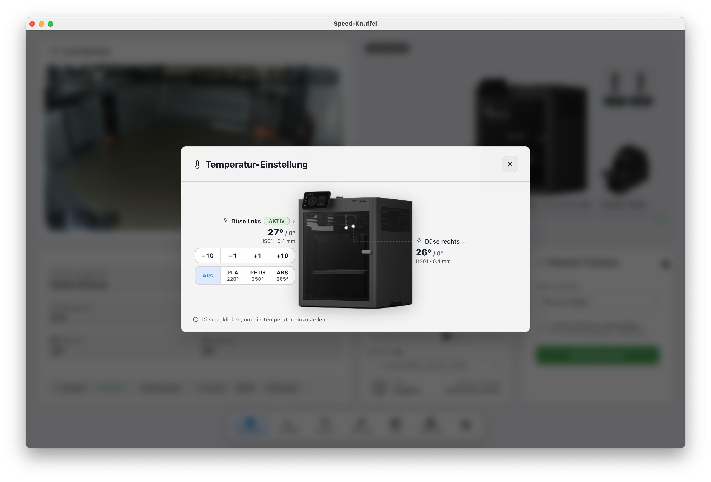</a>
<a href="docs/screenshots/dialog-filament-edit.png">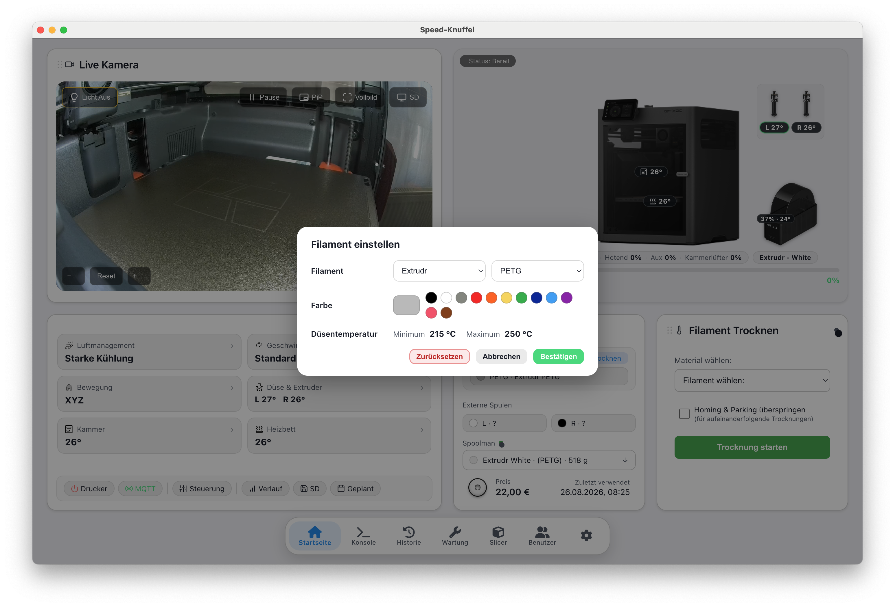</a>
<a href="docs/screenshots/dialog-spool-select.png">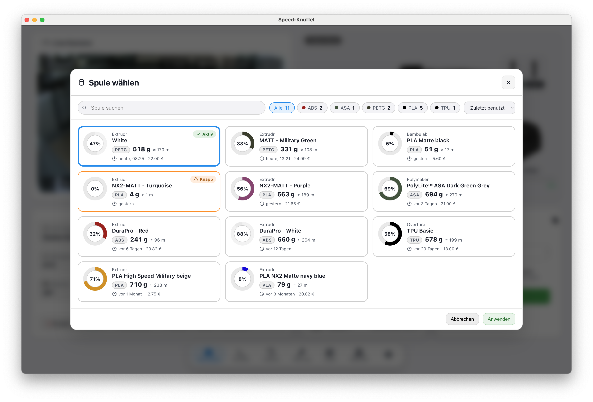</a>
<a href="docs/screenshots/dialog-sensors.png">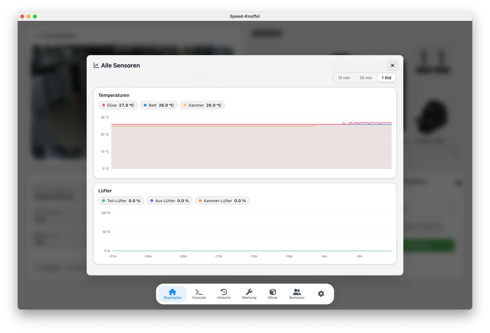</a>
</div>

**Settings and console:**

<div align="center">
<a href="docs/screenshots/settings-connection.png">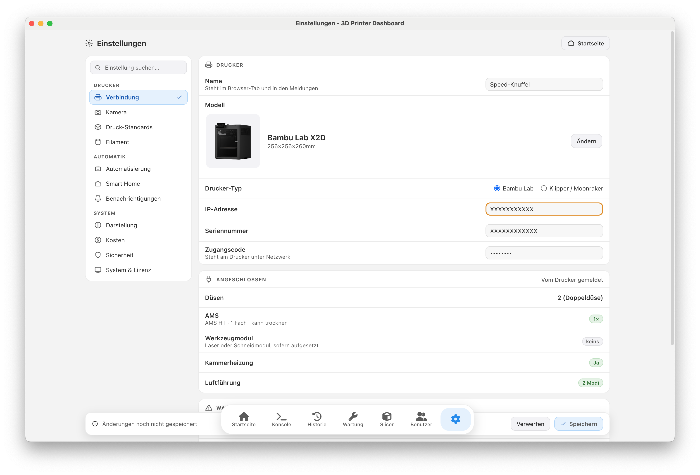</a>
<a href="docs/screenshots/settings-system.png">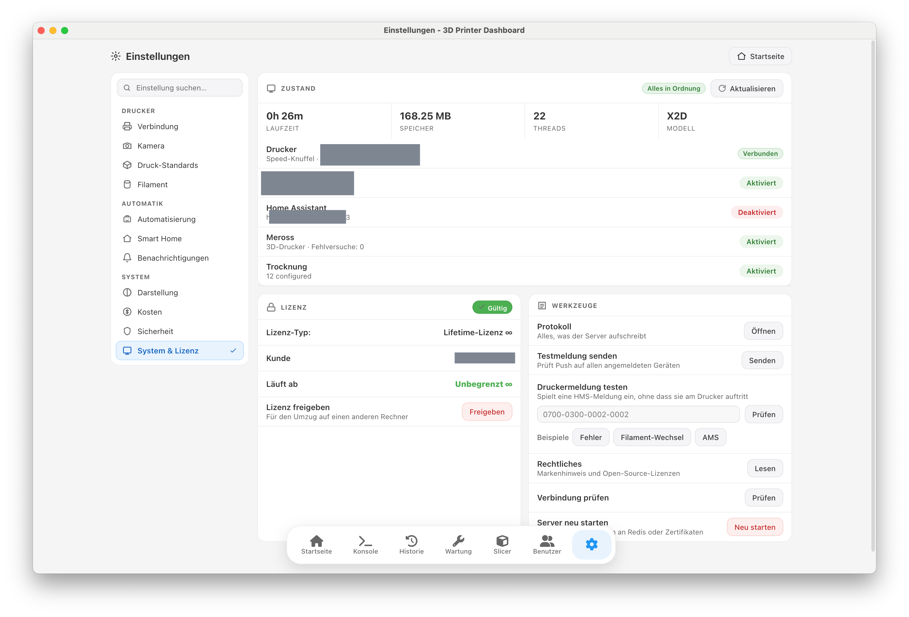</a>
<a href="docs/screenshots/console.png">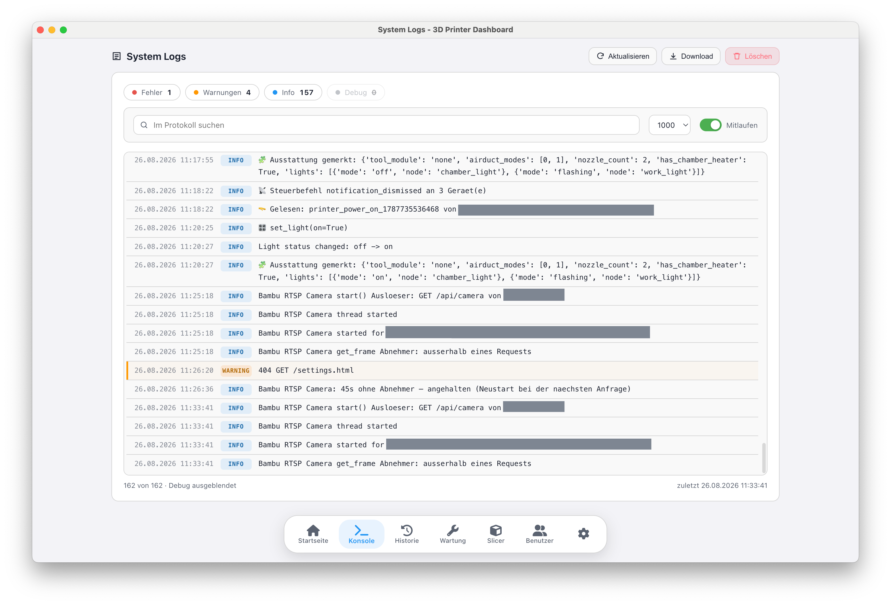</a>
</div>

**Light, dark, or follow the system** — everywhere, one switch.

---

## 🔀 Operating modes

The server talks to two printer families. The mode is per printer; both can run
side by side.

| Mode | Printer | Transport |
|---|---|---|
| **Bambu** | Bambu Lab, 13 models | MQTT over TLS + FTPS |
| **Klipper — on the printer** | Klipper/Moonraker | Moonraker HTTP + WebSocket |
| **Klipper — external host** | Klipper/Moonraker | Moonraker HTTP + WebSocket |

Several Klipper printers at once, each with its own `base_url` and optional API key.

A small **companion** service runs next to Klipper on the printer and handles what
only the printer can know: print history including power draw, maintenance
tracking, bed mesh per print, drying, push and iOS Live Activities.

### Supported printers

**Bambu Lab** — each with its own capability profile (nozzle count, chamber heater,
air duct, tool module):

| | | |
|---|---|---|
| P1P | X1 Carbon | H2S |
| P1S | X1E | H2D |
| P2S | A1 | H2D Pro |
| A2L | A1 mini | H2C |
| X2D (dual nozzle) | | |

Capabilities come from what the printer reports over MQTT; the data sheet only
fills gaps until it does. A printer that reports something different wins.

**Klipper** — anything reachable through Moonraker.

> Deliberately not supported: Klipper together with Wear OS.

---

## 📱 Apps

Five clients, one server. Web and desktop are pushed over a socket; the mobile apps
deliberately poll every five seconds instead, which survives flaky mobile networks
far better.

| Client | Built with | Notes |
|---|---|---|
| **Web** | Vanilla JS, Socket.IO | Any browser, nothing to install |
| **Desktop** | Electron | Same features as the web, everything cached up front |
| **iOS** | Swift, UIKit + SwiftUI | Live Activities, Dynamic Island, widgets, built-in WireGuard |
| **Android** | Kotlin, Jetpack Compose | Phone and tablet layouts, Android 16 Live Updates |
| **macOS server app** | Swift | Runs and supervises the server itself |

### 🍎 iOS

**Live Activities** put the print on the lock screen and, on iPhone 14 Pro and
newer, in the Dynamic Island — started by push when the print starts, updated once
a second (Apple's limit).

**Home screen widgets** in three sizes with progress, temperatures and the
thumbnail.

Plus Siri shortcuts, background refresh, haptics, offline cache, and a theme
manager that follows the system.

> The apps are not distributed here. This repository is the server.

---

## 🌍 Languages

🇩🇪 German · 🇬🇧 English · 🇪🇸 Spanish · 🇫🇷 French · 🇮🇹 Italian

2313 strings in each, identical key sets, checked. Switchable on the login screen
before you even sign in.

---

## 🔧 What the installer does

In this order. Every step says what it found and what it skipped.

1. **System packages** — Python 3.13 with `venv` and `dev`, build tools, image and
   GPIO libraries
2. **OrcaSlicer** — current release, for slicing on the server
3. **Docker** — only if it is not already there
4. **Spoolman** — **an existing installation is left alone.** If a container named
   `spoolman` runs, or something answers on port 7912, the step stands aside and
   the configuration adopts that instance
5. **Application directory** — `/opt/printer-web-app`, then the files
6. **go2rtc** — the camera relay, matching your architecture
7. **Python environment** — a venv with the runtime dependencies
8. **Configuration** — a detected Spoolman is filled in
9. **TLS certificate** — self-signed, 825 days
10. **Cloudflare Tunnel** and **Firebase** — optional, both ask, both default to no
11. **systemd unit** — `printer-web-app.service`, starts at boot

### 💻 Platforms

Compiled modules carry the Python version and the architecture in their file names,
and CPython loads **only** an exact match — a module built for 3.13 is not even
*found* by 3.12. The installer reads the required version out of the shipped
filenames and stops with instructions if it is missing.

| Architecture | Status |
|---|---|
| `aarch64` — Raspberry Pi 4/5, ARM64 boards | shipped, Python 3.13 |
| `x86_64`, `armv7l` | not currently built — ask if you need one |

### Two details worth knowing

**go2rtc is not a systemd service.** The server starts and stops it itself, in step
with the printer's power, and writes its configuration with the device's current
RTSP address beforehand.

**`SuccessExitStatus=42`** is in the unit. The restart button in the web interface
ends the server with exit code 42; without that line systemd counts each one as a
failure and, after five in a row, refuses to start the service at all.

---

## 🛠️ Running it

```bash
sudo systemctl status printer-web-app     # is it running?
sudo journalctl -u printer-web-app -f     # what is it saying?
sudo systemctl restart printer-web-app    # restart
cd /opt/printer-web-app && sudo ./manage.sh   # menu: update, backup, logs
```

**Update:** `sudo ./manage.sh` → *Update*, or run the installer again. It
recognises an existing installation.

---

## 🐛 When something goes wrong

<details>
<summary><b>The server does not start</b></summary>

```bash
sudo journalctl -u printer-web-app -n 50
```

The most common cause is a Python version that does not match the compiled
modules. The installer names it explicitly. Check with `python3 --version` — it
must be 3.13.
</details>

<details>
<summary><b>The browser shows nothing / no styling</b></summary>

The static files ship with the distribution; a partial download shows up as a page
without styling. Run the installer again.
</details>

<details>
<summary><b>The access code is rejected</b></summary>

It is **8 characters** and contains letters, not only digits. You will find it on
the printer under *Settings → Network*. Regenerating it there is harmless.
</details>

<details>
<summary><b>No connection to the printer</b></summary>

1. `ping <printer-ip>` — is it reachable at all?
2. Serial number complete? It is 15 characters, e.g. `01P09C4C1700729`
3. Developer mode / LAN mode enabled on the printer?
4. Firewall: `sudo ufw allow 8883/tcp`
</details>

<details>
<summary><b>No camera picture</b></summary>

Without a printer that answers, the camera has nothing to show — the card says so
instead of freezing on the last frame. With go2rtc installed the mode is WebRTC,
otherwise MJPEG. `curl -s http://127.0.0.1:1984/api/streams` shows whether the
relay has a stream.
</details>

<details>
<summary><b>Spoolman gone after the install</b></summary>

It should not be — the installer leaves a running instance alone. If it did
happen: `docker ps -a` and the log of the Spoolman step will say what went on.
</details>

<details>
<summary><b>Reset the whole thing and start over</b></summary>

```bash
sudo systemctl stop printer-web-app
sudo systemctl disable printer-web-app
sudo rm -f /etc/systemd/system/printer-web-app.service
sudo systemctl daemon-reload
sudo rm -rf /opt/printer-web-app
```

Docker, Spoolman and Home Assistant are untouched by this. Then start again at
step 1.
</details>

Full log of the installation: `/tmp/printer-app-install.log`

---

## 🔐 Licence

The server needs a licence key. Verification is **offline**: the token is signed
with Ed25519 and carries a hash of the hardware id of the machine it belongs to.
Since 01 Sep 2026 that binding is checked on every platform, not just macOS.

Your installation's licence page shows the hardware id with a copy button and
tells you where to send it. The address is not printed here on purpose.

Moving to another machine: release the licence in *Settings → System & licence*,
then activate it on the new one.

---

## 🏗️ Built with

**Server** — Python (Flask, Socket.IO), SQLite for accounts, sessions, history and
maintenance, MQTT to the printer, FTPS for the SD card, ffmpeg for timelapses,
go2rtc for the camera, Cython for the shipped modules.

**Clients** — Swift with SwiftUI/UIKit and ActivityKit/WidgetKit on iOS, Kotlin
with Jetpack Compose on Android, Electron on the desktop, vanilla JS with Socket.IO
in the browser.

**Integrations** — Moonraker, Spoolman, Home Assistant, Meross, Firebase Cloud
Messaging, WireGuard.

---

## 📋 Requirements

| | Minimum | Recommended |
|---|---|---|
| **Python** | must match the build | 3.13 |
| **RAM** | 512 MB | 2 GB+ |
| **Disk** | 2 GB | 10 GB+ with timelapses |
| **CPU** | 1 core @ 1 GHz | 2+ cores @ 1.5 GHz |
| **iOS** | — | 16.1+ for Live Activities |

---

<div align="center">

**Version 2.1.4** · 🇩🇪 [Deutsche Fassung](README.de.md)

Made for the 3D printing community

</div>
